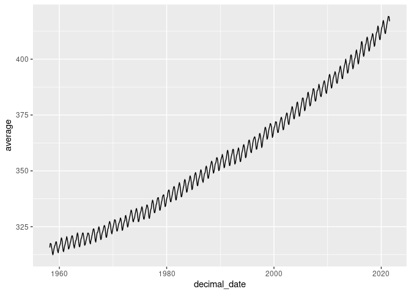
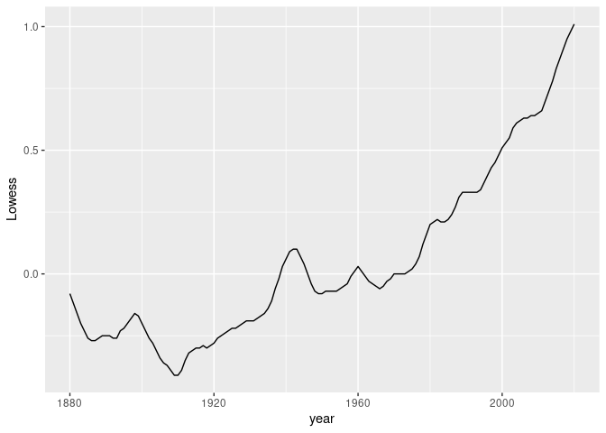
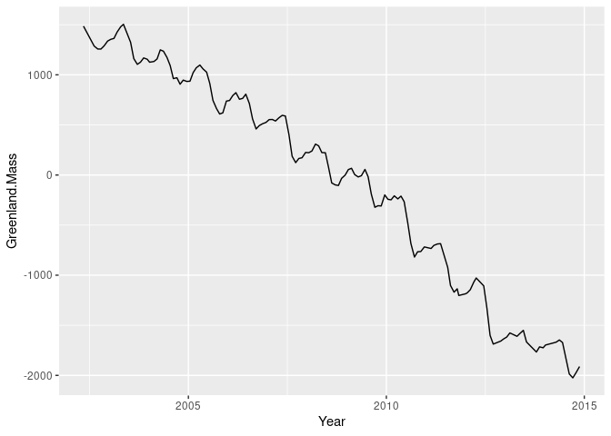
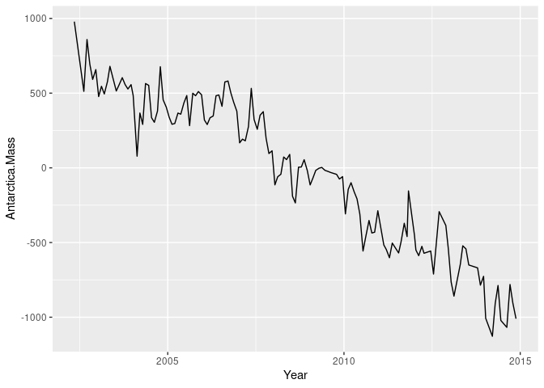
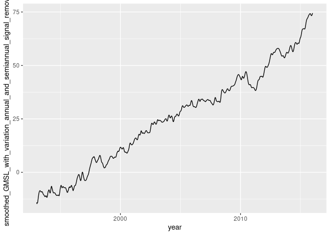
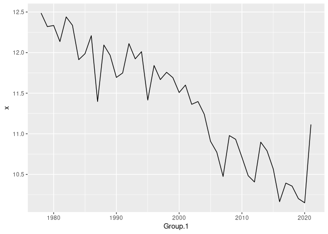
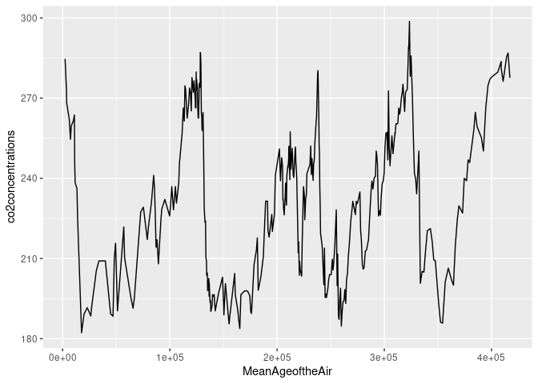
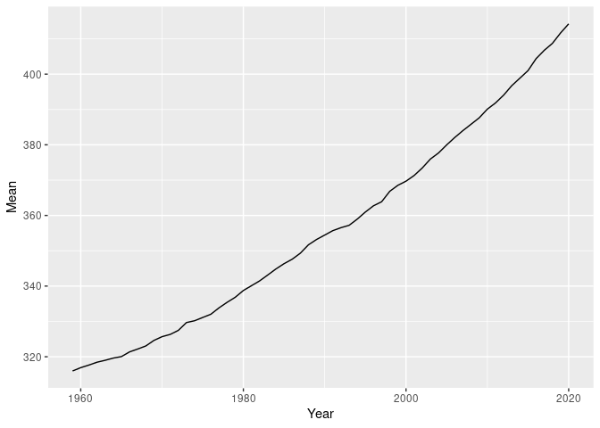

Climate Exercise
================
Carl Boettiger & Dana Seidel

# Unit I: Climate Change Module

## Warm-up exercise: Examining CO2 trends in R

  - Example from <http://climate.nasa.gov/vital-signs/carbon-dioxide/>
  - Raw data from
    <https://gml.noaa.gov/webdata/ccgg/trends/co2/co2_mm_mlo.txt>

<!-- end list -->

``` r
library(tidyverse)
library(dplyr)
```

``` r
co2 <- 
read_table("co2_mm_mlo.txt", 
                  comment="#",
                  col_names = c("year", "month", "decimal_date", "average",
                                "interpolated", "trend", "days"),
                  na = c("-1", "-99.99"))
```

    ## Warning: 761 parsing failures.
    ## row col  expected    actual             file
    ##   1  -- 7 columns 8 columns 'co2_mm_mlo.txt'
    ##   2  -- 7 columns 8 columns 'co2_mm_mlo.txt'
    ##   3  -- 7 columns 8 columns 'co2_mm_mlo.txt'
    ##   4  -- 7 columns 8 columns 'co2_mm_mlo.txt'
    ##   5  -- 7 columns 8 columns 'co2_mm_mlo.txt'
    ## ... ... ......... ......... ................
    ## See problems(...) for more details.

``` r
co2
```

    ## # A tibble: 761 × 7
    ##     year month decimal_date average interpolated trend  days
    ##    <dbl> <dbl>        <dbl>   <dbl>        <dbl> <dbl> <dbl>
    ##  1  1958     3        1958.    316.         314.    NA -9.99
    ##  2  1958     4        1958.    317.         315.    NA -9.99
    ##  3  1958     5        1958.    318.         315.    NA -9.99
    ##  4  1958     6        1958.    317.         315.    NA -9.99
    ##  5  1958     7        1959.    316.         315.    NA -9.99
    ##  6  1958     8        1959.    315.         316.    NA -9.99
    ##  7  1958     9        1959.    313.         316.    NA -9.99
    ##  8  1958    10        1959.    312.         315.    NA -9.99
    ##  9  1958    11        1959.    313.         315.    NA -9.99
    ## 10  1958    12        1959.    315.         315.    NA -9.99
    ## # … with 751 more rows

``` r
ggplot(co2, aes(x = decimal_date, y = average)) + geom_line() 
```

<!-- -->

Which months are the CO2 values at the maximum? Minimum? Why is this?

The month with maximum CO2 is May, and the months with minimum CO2 is
September and October. The reason is that the plants will grow in May
when they will remove much CO2 from the atmosphere. However, in the
fall, the plants cease growing and the CO2 concentrations increase
again.

What rolling average is used in computing the “trend” line? How does the
trend depend on the rolling average?

The yearly rolling average data is used in computing the “trend” line.

-----

# Exercise I: Temperature Data

Each of the last years has consecutively set new records on global
climate. In this section we will analyze global mean temperature data.

Data from: <http://climate.nasa.gov/vital-signs/global-temperature>

## Question 1:

Describe the data set to the best of your ability given the
documentation provided. Describe what kind of column each data contains
and what units it is measured in. Then address our three key questions
in understanding this data:

The data set shows the difference between annual average temperature and
the 30-year average temperature of 1951-1980 in the period of 1880 to
2020. The data set contains a column of raw temperature difference and a
column of temperature difference obtained from smoothing. The unit is
celsius degree.

  - How are the measurements made? What is the associated measurement
    uncertainty?

The measurements are made by subtracting the annual average temperature
from the 1951-1980 average temperature. An uncertainty is the accuracy
of the measuring instruments as they must have changed in such a long
period.

  - What is the resolution of the data?

Each data point keeps two decimal places.

  - Are their missing values? How should they be handled?

There is no missing value. If there is, it can be handled by assigning
it the average value of the five or ten data points surrounding it.

## Question 2:

Construct the necessary R code to import and prepare for manipulation
the following data set:
<http://climate.nasa.gov/system/internal_resources/details/original/647_Global_Temperature_Data_File.txt>

``` r
gt <- read_table("647_Global_Temperature_Data_File.txt", 
                  comment="#",
                 col_names = c("year","NoSmoothing","Lowess"))
```

    ## 
    ## ── Column specification ────────────────────────────────────────────────────────
    ## cols(
    ##   year = col_double(),
    ##   NoSmoothing = col_double(),
    ##   Lowess = col_double()
    ## )

``` r
gt
```

    ## # A tibble: 141 × 3
    ##     year NoSmoothing Lowess
    ##    <dbl>       <dbl>  <dbl>
    ##  1  1880       -0.16  -0.08
    ##  2  1881       -0.08  -0.12
    ##  3  1882       -0.1   -0.16
    ##  4  1883       -0.16  -0.2 
    ##  5  1884       -0.28  -0.23
    ##  6  1885       -0.33  -0.26
    ##  7  1886       -0.31  -0.27
    ##  8  1887       -0.36  -0.27
    ##  9  1888       -0.17  -0.26
    ## 10  1889       -0.1   -0.25
    ## # … with 131 more rows

## Question 3:

Plot the trend in global mean temperatures over time. Describe what you
see in the plot and how you interpret the patterns you observe.

``` r
ggplot(gt, aes(x =year, y =Lowess)) + geom_line() 
```

<!-- --> The trend
line is smoother than the average temperature line. Since each data
entry of the temporal column (trend) is closer to each other than the
column of month, the plotted line will then be smoother with less
fluctuations. The line is to demonstrate an overall rising pattern of
global temperature regardless of the fluctuations in each year.

## Question 4: Evaluating the evidence for a “Pause” in warming?

The [2013 IPCC
Report](https://www.ipcc.ch/pdf/assessment-report/ar5/wg1/WG1AR5_SummaryVolume_FINAL.pdf)
included a tentative observation of a “much smaller increasing trend” in
global mean temperatures since 1998 than was observed previously. This
led to much discussion in the media about the existence of a “Pause” or
“Hiatus” in global warming rates, as well as much research looking
into where the extra heat could have gone. (Examples discussing this
question include articles in [The
Guardian](http://www.theguardian.com/environment/2015/jun/04/global-warming-hasnt-paused-study-finds),
[BBC News](http://www.bbc.com/news/science-environment-28870988), and
[Wikipedia](https://en.wikipedia.org/wiki/Global_warming_hiatus)).

By examining the data here, what evidence do you find or not find for
such a pause? Present an analysis of this data (using the tools &
methods we have covered in Foundation course so far) to argue your case.

One of the evidence is that due to the increasing amount of aerosols in
the air, there will be more wave energy reflected back to the universe.
Thus, it looks like that there is a “Pause” in global warming. Other
proposed evidences include the periodic upwelling of cooler currents in
Pacific to absorb heat and the sinking of current in Atlantic to bury
remarkable amount of heat into bottom of the sea. However, the new study
suggests that the warming rate in the recent 15 years prior to 2014 have
just been the same as before. Previous study got the apparent “Pause”
result just because it did not account for the change in temperature
measuring method across the measuring period.

What additional analyses or data sources would better help you refine
your arguments?

Learning about the specific methods of natural systems heat flow
modeling and global temperature measurement by the previous studies can
provide better insight on the accuracy of the results. Temperature
change distribution among different regions around the globe may also be
useful.

## Question 5: Rolling averages

  - What is the meaning of “5 year average” vs “annual average”?
  - Plot the different averages and describe what differences you see
    and why.  
  - Construct 5 year averages from the annual data. Construct 10 &
    20-year averages.
  - Plot the different averages and describe what differences you see
    and why.

The meaning of “5 year average” is the mean value from a range of five
years. However, the annual average is the mean value from just one year.
According to the plot from the websites, the 5 year average and 10 year
average graphs will be smoother. Due to the climate changes and the
global greenhouse effects, we can see the global temperatures are in a
constantly increasing trend. This trend will bring many further negative
impacts on our environment, and we really need to solve these issues.

# Exercise II: Melting Ice Sheets?

  - Data description: <http://climate.nasa.gov/vital-signs/land-ice/>
  - Raw data file:
    <http://climate.nasa.gov/system/internal_resources/details/original/499_GRN_ANT_mass_changes.csv>

## Question 1:

  - Describe the data set: what are the columns and units? Where do the
    numbers come from?
  - What is the uncertainty in measurement? Resolution of the data?
    Interpretation of missing values?

The columns are data for Time (units: year in decimal), Greenland mass
(units: Gross Tonnage), and Antarctica mass (units: Gross Tonnage). The
uncertainty behind the measurement is that the ice sheet is losing
significant amounts of land-based ice in a very quick speed, the
accurate and up-to-date measurement of the land mass is hard to get. The
resolution of the data is in meters. The missing values should be the
data that cannot be directly acquired by satellites.

## Question 2:

Construct the necessary R code to import this data set as a tidy `Table`
object.

``` r
icesheet <- read.csv("499_GRN_ANT_mass_changes.csv",
                     col.names=c("Year","Greenland Mass","Antarctica Mass"))

icesheet %>% as_tibble()
```

    ## # A tibble: 139 × 3
    ##     Year Greenland.Mass Antarctica.Mass
    ##    <dbl>          <dbl>           <dbl>
    ##  1 2002.          1486.            979.
    ##  2 2003.          1287.            512.
    ##  3 2003.          1258.            859.
    ##  4 2003.          1257.            694.
    ##  5 2003.          1288.            592.
    ##  6 2003.          1337.            658.
    ##  7 2003.          1354.            477.
    ##  8 2003.          1363.            546.
    ##  9 2003.          1427.            494.
    ## 10 2003.          1480.            577.
    ## # … with 129 more rows

``` r
icesheet
```

    ##        Year Greenland.Mass Antarctica.Mass
    ## 1   2002.35        1485.69          978.55
    ## 2   2002.62        1286.84          512.02
    ## 3   2002.71        1257.85          858.85
    ## 4   2002.79        1257.17          693.87
    ## 5   2002.87        1288.44          591.80
    ## 6   2002.96        1336.86          657.56
    ## 7   2003.04        1354.37          477.02
    ## 8   2003.12        1363.42          545.79
    ## 9   2003.20        1426.92          494.39
    ## 10  2003.29        1479.79          577.30
    ## 11  2003.36        1504.11          679.30
    ## 12  2003.54        1324.70          514.42
    ## 13  2003.62        1162.43          555.60
    ## 14  2003.71        1104.46          603.51
    ## 15  2003.79        1126.45          557.76
    ## 16  2003.87        1168.57          527.64
    ## 17  2003.96        1155.66          556.80
    ## 18  2004.02        1125.85          483.31
    ## 19  2004.13        1133.01           77.93
    ## 20  2004.21        1159.06          366.80
    ## 21  2004.29        1249.03          290.70
    ## 22  2004.37        1235.60          564.23
    ## 23  2004.46        1172.84          552.07
    ## 24  2004.54        1092.28          335.96
    ## 25  2004.62         962.16          304.95
    ## 26  2004.71         970.66          380.40
    ## 27  2004.79         906.18          676.83
    ## 28  2004.87         947.28          455.02
    ## 29  2004.96         933.97          405.30
    ## 30  2005.04         936.41          339.30
    ## 31  2005.12        1021.98          291.52
    ## 32  2005.20        1070.69          296.70
    ## 33  2005.29        1097.61          366.57
    ## 34  2005.37        1058.65          359.15
    ## 35  2005.46        1026.60          435.29
    ## 36  2005.54         914.10          483.75
    ## 37  2005.62         744.81          282.45
    ## 38  2005.71         663.34          499.22
    ## 39  2005.79         608.83          482.63
    ## 40  2005.87         620.45          510.67
    ## 41  2005.96         737.90          488.80
    ## 42  2006.04         743.89          320.04
    ## 43  2006.12         792.83          289.87
    ## 44  2006.20         821.97          335.08
    ## 45  2006.29         756.04          347.10
    ## 46  2006.37         764.83          482.54
    ## 47  2006.45         806.94          487.85
    ## 48  2006.54         713.56          411.94
    ## 49  2006.62         560.78          574.89
    ## 50  2006.71         459.64          581.16
    ## 51  2006.79         493.23          502.06
    ## 52  2006.87         511.00          439.38
    ## 53  2006.96         525.09          379.08
    ## 54  2007.04         553.00          167.26
    ## 55  2007.12         554.41          192.01
    ## 56  2007.20         539.07          180.88
    ## 57  2007.29         572.07          276.22
    ## 58  2007.37         595.57          531.76
    ## 59  2007.45         588.49          323.30
    ## 60  2007.54         402.47          258.12
    ## 61  2007.62         187.15          352.29
    ## 62  2007.71         123.37          375.79
    ## 63  2007.79         165.13          197.94
    ## 64  2007.87         172.27           95.73
    ## 65  2007.96         225.21          114.11
    ## 66  2008.04         222.64         -114.03
    ## 67  2008.12         239.65          -59.76
    ## 68  2008.21         308.63          -42.86
    ## 69  2008.29         291.09           72.41
    ## 70  2008.37         224.06           55.08
    ## 71  2008.46         222.15           89.79
    ## 72  2008.54          76.38         -190.35
    ## 73  2008.62         -79.26         -234.85
    ## 74  2008.71         -98.79            4.40
    ## 75  2008.79        -104.46            5.44
    ## 76  2008.87         -33.26           54.43
    ## 77  2008.96          -0.64          -18.83
    ## 78  2009.04          53.99         -114.48
    ## 79  2009.12          67.25          -67.51
    ## 80  2009.20           4.28          -16.88
    ## 81  2009.29         -19.28           -2.92
    ## 82  2009.37          -6.57            2.72
    ## 83  2009.46          55.73          -16.84
    ## 84  2009.54         -17.52          -23.45
    ## 85  2009.62        -190.20          -30.95
    ## 86  2009.71        -322.11          -37.72
    ## 87  2009.79        -306.62          -43.66
    ## 88  2009.87        -308.94          -74.95
    ## 89  2009.96        -198.67          -58.87
    ## 90  2010.04        -242.49         -308.32
    ## 91  2010.12        -247.56         -144.55
    ## 92  2010.20        -207.89          -99.46
    ## 93  2010.29        -238.37         -161.34
    ## 94  2010.37        -210.75         -207.92
    ## 95  2010.45        -266.04         -310.03
    ## 96  2010.54        -476.04         -556.86
    ## 97  2010.62        -683.74         -458.46
    ## 98  2010.71        -818.78         -352.28
    ## 99  2010.79        -766.25         -436.11
    ## 100 2010.87        -763.72         -430.87
    ## 101 2010.96        -717.83         -287.40
    ## 102 2011.13        -733.29         -516.25
    ## 103 2011.20        -702.67         -546.53
    ## 104 2011.29        -688.35         -601.67
    ## 105 2011.37        -685.31         -503.56
    ## 106 2011.55        -922.12         -569.77
    ## 107 2011.62       -1102.54         -494.07
    ## 108 2011.71       -1169.35         -371.17
    ## 109 2011.79       -1136.17         -460.04
    ## 110 2011.83       -1202.49         -154.55
    ## 111 2012.00       -1185.68         -452.20
    ## 112 2012.04       -1177.29         -550.20
    ## 113 2012.12       -1144.90         -587.79
    ## 114 2012.21       -1067.83         -525.47
    ## 115 2012.27       -1027.98         -571.73
    ## 116 2012.46       -1106.60         -556.78
    ## 117 2012.54       -1328.83         -710.84
    ## 118 2012.62       -1600.71         -503.54
    ## 119 2012.70       -1687.68         -293.29
    ## 120 2012.89       -1657.63         -386.15
    ## 121 2012.96       -1636.74         -542.45
    ## 122 2013.04       -1617.52         -764.15
    ## 123 2013.12       -1576.41         -858.67
    ## 124 2013.30       -1610.05         -645.84
    ## 125 2013.37       -1583.06         -522.00
    ## 126 2013.46       -1550.38         -542.60
    ## 127 2013.54       -1666.54         -650.20
    ## 128 2013.79       -1766.82         -669.63
    ## 129 2013.87       -1715.27         -785.21
    ## 130 2013.96       -1724.47         -726.30
    ## 131 2014.02       -1697.13        -1006.79
    ## 132 2014.21       -1677.03        -1127.43
    ## 133 2014.29       -1668.19         -908.13
    ## 134 2014.37       -1646.49         -787.54
    ## 135 2014.45       -1672.08        -1021.70
    ## 136 2014.62       -1985.59        -1067.84
    ## 137 2014.71       -2024.82         -780.87
    ## 138 2014.79       -1973.96         -904.38
    ## 139 2014.88       -1911.78        -1009.80

## Question 3:

Plot the data and describe the trends you observe.

``` r
ggplot(icesheet, aes(x =Year, y =Greenland.Mass)) + geom_line()
```

<!-- -->

``` r
ggplot(icesheet, aes(x =Year, y =Antarctica.Mass)) + geom_line()
```

<!-- -->

As we can see, the overall trend for both Greenland Mass and Antarctica
Mass is downward, and the trend is also winding alone the way.

# Exercise III: Rising Sea Levels?

  - Data description: <http://climate.nasa.gov/vital-signs/sea-level/>
  - Raw data file:
    <http://climate.nasa.gov/system/internal_resources/details/original/121_Global_Sea_Level_Data_File.txt>

## Question 1:

  - Describe the data set: what are the columns and units?
  - Where do these data come from?
  - What is the uncertainty in measurement? Resolution of the data?
    Interpretation of missing values?

The columns are altimeter type, merged file cycle, year+fraction of the
year, number of observations, number of weighted observations, GMSL (GIA
not applied), Standard Deviation of GMSL (GIA not applied), GMSL (GIA
applied), Standard Deviation of GMSL (GIA applied), smoothed GMSL with
variation, smoothed GMSL with variation (annual and semi-annual signal
removed). These data come from NASA’s Goddard Space Flight Center. The
uncertainty in measurement is that the sea level actually is different
in different parts of the world. Therefore, it is hard to capture the
accurate data that describes the earth’s sea level. The resolution of
the data is in meters. The missing values are represented as “99900”,
which are data not captured by the satellites.

## Question 2:

Construct the necessary R code to import this data set as a tidy `Table`
object.

``` r
globalsea <- read_table("globalsea.txt", 
                  comment="#",
                 col_names = c("altimeter type", "merged file cycle", "year", "number of observations", "number of weighted observations", "GMSL (GIA not applied)", "Standard Deviation of GMSL (GIA not applied)","smoothed GMSL variation (GIA not applied)", "GMSL (GIA applied)", "Standard Deviation of GMSL (GIA applied)", "smoothed GMSL with variation (GIA applied)", "smoothed_GMSL_with_variation_annual_and_semiannual_signal_removed"),
                  na = "99900")
```

    ## 
    ## ── Column specification ────────────────────────────────────────────────────────
    ## cols(
    ##   `altimeter type` = col_double(),
    ##   `merged file cycle` = col_double(),
    ##   year = col_double(),
    ##   `number of observations` = col_double(),
    ##   `number of weighted observations` = col_double(),
    ##   `GMSL (GIA not applied)` = col_double(),
    ##   `Standard Deviation of GMSL (GIA not applied)` = col_double(),
    ##   `smoothed GMSL variation (GIA not applied)` = col_double(),
    ##   `GMSL (GIA applied)` = col_double(),
    ##   `Standard Deviation of GMSL (GIA applied)` = col_double(),
    ##   `smoothed GMSL with variation (GIA applied)` = col_double(),
    ##   smoothed_GMSL_with_variation_annual_and_semiannual_signal_removed = col_double()
    ## )

``` r
globalsea
```

    ## # A tibble: 847 × 12
    ##    `altimeter type` `merged file cycle`  year `number of obser… `number of weig…
    ##               <dbl>               <dbl> <dbl>             <dbl>            <dbl>
    ##  1                0                  11 1993.            463892          336485.
    ##  2                0                  12 1993.            458154          333208.
    ##  3                0                  13 1993.            469524          341593.
    ##  4                0                  14 1993.            419112          305335.
    ##  5                0                  15 1993.            456793          330244.
    ##  6                0                  16 1993.            414055          299600.
    ##  7                0                  17 1993.            465235          336243.
    ##  8                0                  18 1993.            463257          334575.
    ##  9                0                  19 1993.            458542          330751.
    ## 10              999                  20 1993.            464921          339267.
    ## # … with 837 more rows, and 7 more variables: GMSL (GIA not applied) <dbl>,
    ## #   Standard Deviation of GMSL (GIA not applied) <dbl>,
    ## #   smoothed GMSL variation (GIA not applied) <dbl>, GMSL (GIA applied) <dbl>,
    ## #   Standard Deviation of GMSL (GIA applied) <dbl>,
    ## #   smoothed GMSL with variation (GIA applied) <dbl>,
    ## #   smoothed_GMSL_with_variation_annual_and_semiannual_signal_removed <dbl>

## Question 3:

Plot the data and describe the trends you observe.

``` r
ggplot(globalsea, aes(x =year, y =smoothed_GMSL_with_variation_annual_and_semiannual_signal_removed)) + geom_line()
```

<!-- --> As we can
see from the graph, the sea level keeps increasing.

# Exercise IV: Arctic Sea Ice?

  - <http://nsidc.org/data/G02135>
  - <ftp://sidads.colorado.edu/DATASETS/NOAA/G02135/north/daily/data/N_seaice_extent_daily_v3.0.csv>

## Question 1:

  - Describe the data set: what are the columns and units?
  - Where do these data come from?
  - What is the uncertainty in measurement? Resolution of the data?
    Interpretation of missing values?

The columns are year, month, day, extent, missing values, and source
data. The data come from satellite platforms including DMSP, DMSP
5D-3/F17, DMSP 5D-3/F18, Nimbus-7. The uncertainty in measurement is
that there are some error measurements in daily data products. The
spatial resolution of the data is 25km x 25km, and the temporal
resolution of the data is 1 day. The missing values are errors in daily
products.

## Question 2:

Construct the necessary R code to import this data set as a tidy `Table`
object.

``` r
seaice <- read.csv("seaice.csv")
seaice %>% as_tibble()
```

    ## # A tibble: 14,016 × 6
    ##     Year Month   Day Extent Missing Source.Data                                 
    ##    <int> <int> <int>  <dbl>   <dbl> <chr>                                       
    ##  1  1978    10    26   10.2       0 " ['/ecs/DP1/PM/NSIDC-0051.001/1978.10.26/n…
    ##  2  1978    10    28   10.4       0 " ['/ecs/DP1/PM/NSIDC-0051.001/1978.10.28/n…
    ##  3  1978    10    30   10.6       0 " ['/ecs/DP1/PM/NSIDC-0051.001/1978.10.30/n…
    ##  4  1978    11     1   10.7       0 " ['/ecs/DP1/PM/NSIDC-0051.001/1978.11.01/n…
    ##  5  1978    11     3   10.8       0 " ['/ecs/DP1/PM/NSIDC-0051.001/1978.11.03/n…
    ##  6  1978    11     5   11.0       0 " ['/ecs/DP1/PM/NSIDC-0051.001/1978.11.05/n…
    ##  7  1978    11     7   11.1       0 " ['/ecs/DP1/PM/NSIDC-0051.001/1978.11.07/n…
    ##  8  1978    11     9   11.2       0 " ['/ecs/DP1/PM/NSIDC-0051.001/1978.11.09/n…
    ##  9  1978    11    11   11.3       0 " ['/ecs/DP1/PM/NSIDC-0051.001/1978.11.11/n…
    ## 10  1978    11    13   11.5       0 " ['/ecs/DP1/PM/NSIDC-0051.001/1978.11.13/n…
    ## # … with 14,006 more rows

``` r
seaice_agg <- aggregate(seaice[, 4], list(seaice$Year), mean)
seaice_agg
```

    ##    Group.1        x
    ## 1     1978 12.48700
    ## 2     1979 12.31956
    ## 3     1980 12.33415
    ## 4     1981 12.13549
    ## 5     1982 12.43945
    ## 6     1983 12.33590
    ## 7     1984 11.91260
    ## 8     1985 11.98660
    ## 9     1986 12.20822
    ## 10    1987 11.39723
    ## 11    1988 12.09317
    ## 12    1989 11.96685
    ## 13    1990 11.69384
    ## 14    1991 11.74926
    ## 15    1992 12.11048
    ## 16    1993 11.92305
    ## 17    1994 12.01132
    ## 18    1995 11.41511
    ## 19    1996 11.84079
    ## 20    1997 11.66761
    ## 21    1998 11.75738
    ## 22    1999 11.69147
    ## 23    2000 11.50817
    ## 24    2001 11.60002
    ## 25    2002 11.36287
    ## 26    2003 11.39722
    ## 27    2004 11.24043
    ## 28    2005 10.90698
    ## 29    2006 10.77261
    ## 30    2007 10.47410
    ## 31    2008 10.97785
    ## 32    2009 10.93197
    ## 33    2010 10.71139
    ## 34    2011 10.48350
    ## 35    2012 10.40610
    ## 36    2013 10.89712
    ## 37    2014 10.79050
    ## 38    2015 10.56582
    ## 39    2016 10.16348
    ## 40    2017 10.39270
    ## 41    2018 10.35504
    ## 42    2019 10.20098
    ## 43    2020 10.14987
    ## 44    2021 11.11460

## Question 3:

Plot the data and describe the trends you observe.

``` r
seaicep <- ggplot(seaice_agg, aes(x =Group.1, y =x)) + geom_line()
seaicep
```

<!-- -->

# Exercise V: Longer term trends in CO2 Records

The data we analyzed in the unit introduction included CO2 records
dating back only as far as the measurements at the Manua Loa
observatory. To put these values into geological perspective requires
looking back much farther than humans have been monitoring atmospheric
CO2 levels. To do this, we need another approach.

[Ice core data](http://cdiac.ornl.gov/trends/co2/ice_core_co2.html):

Vostok Core, back to 400,000 yrs before present day

  - Description of data set:
    <http://cdiac.esd.ornl.gov/trends/co2/vostok.html>
  - Data source:
    <http://cdiac.ornl.gov/ftp/trends/co2/vostok.icecore.co2>

## Questions / Tasks:

  - Describe the data set: what are the columns and units? Where do the
    numbers come from?
  - What is the uncertainty in measurement? Resolution of the data?
    Interpretation of missing values?
  - Read in and prepare data for analysis.
  - Reverse the ordering to create a chronological record.  
  - Plot data
  - Consider various smoothing windowed averages of the data.
  - Join this series to Mauna Loa data
  - Plot joined data
  - Describe your conclusions

The columns of the data set include depth, age of the ice, mean age of
the air, and co2 concentrations. The numbers come from ice samples
analyzed by Arctic and Antarctic Research Institute. The uncertainty in
measurement is that we cannot capture a whole period of co2 data because
the distribution of the ice is not regular. The resolution of the data
is in meters. The missing values are data that cannot be extracted by
ice core.

``` r
icecore <- read_table("icecore.co2.txt", 
                  comment="#",
                 col_names = c("Depth","AgeoftheIce","MeanAgeoftheAir","co2concentrations"))
```

    ## 
    ## ── Column specification ────────────────────────────────────────────────────────
    ## cols(
    ##   Depth = col_double(),
    ##   AgeoftheIce = col_double(),
    ##   MeanAgeoftheAir = col_double(),
    ##   co2concentrations = col_double()
    ## )

``` r
rev_icecore <- icecore[nrow(icecore):1, ]
icecore
```

    ## # A tibble: 363 × 4
    ##    Depth AgeoftheIce MeanAgeoftheAir co2concentrations
    ##    <dbl>       <dbl>           <dbl>             <dbl>
    ##  1  149.        5679            2342              285.
    ##  2  173.        6828            3634              273.
    ##  3  177.        7043            3833              268.
    ##  4  229.        9523            6220              262.
    ##  5  250.       10579            7327              255.
    ##  6  266        11334            8113              260.
    ##  7  303.       13449           10123              262.
    ##  8  321.       14538           11013              264.
    ##  9  332.       15208           11326              245.
    ## 10  342.       15922           11719              238.
    ## # … with 353 more rows

``` r
rev_icecore
```

    ## # A tibble: 363 × 4
    ##    Depth AgeoftheIce MeanAgeoftheAir co2concentrations
    ##    <dbl>       <dbl>           <dbl>             <dbl>
    ##  1 3304.      419328          417160              278.
    ##  2 3301.      417638          415434              287.
    ##  3 3299.      416332          414085              286.
    ##  4 3293.      413010          410831              276.
    ##  5 3289.      411202          409022              284.
    ##  6 3289.      411202          409022              281.
    ##  7 3284.      408236          405844              280.
    ##  8 3274.      403173          400390              278 
    ##  9 3271.      401423          398554              277.
    ## 10 3268.      399733          396713              275.
    ## # … with 353 more rows

``` r
icecoreco2 <- ggplot(rev_icecore, aes(x =MeanAgeoftheAir, y =co2concentrations)) + geom_line()
icecoreco2
```

<!-- -->

``` r
co2mauna <- read_table("co2_mauna.txt", 
                  comment="#",
                 col_names = c("Year","Mean","Unc"))
```

    ## 
    ## ── Column specification ────────────────────────────────────────────────────────
    ## cols(
    ##   Year = col_double(),
    ##   Mean = col_double(),
    ##   Unc = col_double()
    ## )

``` r
co2mauna
```

    ## # A tibble: 62 × 3
    ##     Year  Mean   Unc
    ##    <dbl> <dbl> <dbl>
    ##  1  1959  316.  0.12
    ##  2  1960  317.  0.12
    ##  3  1961  318.  0.12
    ##  4  1962  318.  0.12
    ##  5  1963  319.  0.12
    ##  6  1964  320.  0.12
    ##  7  1965  320.  0.12
    ##  8  1966  321.  0.12
    ##  9  1967  322.  0.12
    ## 10  1968  323.  0.12
    ## # … with 52 more rows

``` r
co2mp <- ggplot(co2mauna, aes(x =Year, y =Mean)) + geom_line()
co2mp
```

<!-- -->

As we can see from two graphs, the overall trend of co2 from ancient to
now (Vostok Core Data) is winding as co2 increases in a period of time
and decreases in a period of time. The trend of co2 concentrations from
Mauna Loa data is overall increasing.
